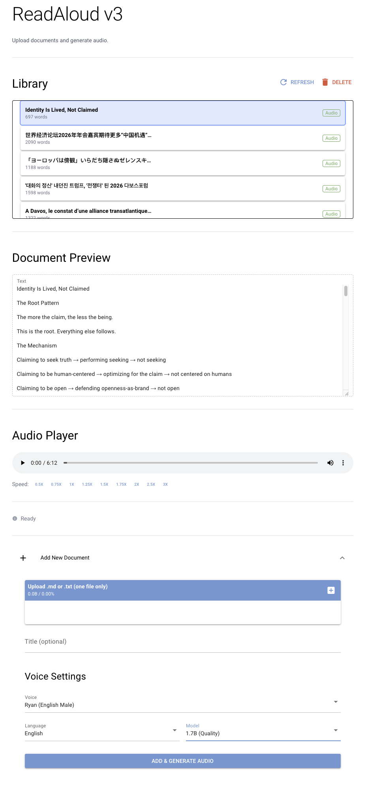

# ReadAloud

**Local-first text-to-speech reader powered by Qwen3-TTS.**

Upload markdown or text files, choose from 9 natural voices, and listen at your preferred speed. Everything runs locally—no cloud, no accounts.



---

## Why This Exists

I built the initial MVP in 7 hours, then spent another 5-7 hours migrating to NiceGUI and adding advanced features. Total: ~12-14 hours to demonstrate a thesis: **AI-augmented development delivers orders of magnitude efficiency improvements over traditional hand-coding.**

But the motivation goes deeper.

### The Parallel Journey

In 2017, I discovered 樊登读书—a Chinese app where the founder summarizes books in 45-minute audio tracks. I was hooked. One book became ten, became a hundred, became finishing all 300+ books on the platform. My listening speed climbed: 1x → 2x → 3x. Chinese is more information-dense than English; I was processing faster than I ever could by reading.

When that platform couldn't satisfy my pace, I moved to 得到 and consumed another 3000+ books. Then Audible. Then podcasts. Audio became my primary channel for information.

Then I watched [Cliff Weitzman's interview](https://youtu.be/yfALZJcurZw)—the founder of Speechify—and felt recognition. His journey with dyslexia, his father reading Harry Potter onto cassette tapes, learning English through 22 listens of the audiobook, consuming 100 books a year for 16 years. Different starting points, same destination: audio as the unlock.

### The Technical Moment

In January 2025, Qwen released [Qwen3-TTS](https://github.com/QwenLM/Qwen3-TTS)—open-source, runs locally, supports 10 languages. The core technology that powers premium TTS services became freely available.

This project is what happens when personal resonance meets technical timing.

---

## Features

### Core
- **Document Library** — Persistent storage with card-based UI and selection highlighting
- **9 Natural Voices** — Ryan, Aiden, Serena, Vivian, Uncle Fu, Dylan, Eric, Ono Anna, Sohee
- **10 Languages** — English, Chinese, Japanese, Korean, French, German, Spanish, Portuguese, Russian, Italian
- **Speed Control** — 0.5x to 3x playback speed (NiceGUI version)
- **Model Choice** — 0.6B (fast) or 1.7B (higher quality)
- **Fully Local** — No cloud, no accounts, your data stays on your machine

### NiceGUI Version Enhancements (Recommended)
- **Title Auto-Prefill** — Extracts title from markdown `#` headers on upload
- **Duplicate Detection** — SHA-256 content hashing with replace/cancel dialog
- **CJK Text Chunking** — Properly splits Chinese/Japanese/Korean on sentence boundaries (。！？，；：)
- **Progress Indicator** — Shows "Generating chunk X/Y..." during audio generation
- **Extended Speed Control** — 0.5x to 3x via custom HTML5 audio player
- **Screen Recording** — Press 'D' key to record current tab for sharing feedback

---

## Quick Start

### Prerequisites

- Python 3.10+
- ~8GB RAM (for 0.6B model) or ~16GB (for 1.7B model)
- macOS, Linux, or Windows

### Installation

```bash
git clone https://github.com/powerpig99/readaloud.git
cd readaloud

# Create virtual environment
python -m venv venv
source venv/bin/activate  # Windows: venv\Scripts\activate

# Install dependencies
pip install -r requirements.txt
```

### Run

**NiceGUI Version (Recommended):**
```bash
python app_nicegui.py
```
Open http://127.0.0.1:8080 in your browser.

**Gradio Version (Legacy):**
```bash
python app.py
```
Open http://127.0.0.1:7860 in your browser.

**First run:** The TTS model (~1.5GB) downloads automatically from HuggingFace.

---

## Usage

1. Click **Add New Document** accordion
2. Upload a `.md` or `.txt` file (title auto-fills from content)
3. Select voice, language, and model size
4. Click **Add & Generate Audio**
5. Watch progress indicator during generation
6. Use the audio player to listen—select speed with the button row (0.5x-3x)

Your documents and audio persist in the library. Click any card to switch between them.

### Hidden Features

- **Screen Recording**: Press `D` key (not while typing) to record the current tab with audio. Press `D` again or click Chrome's "Stop sharing" to save. Output is WebM (convert to MP4 for X/Twitter with `ffmpeg -i input.webm -c:v libx264 -c:a aac output.mp4`)

---

## Technical Details

### Stack

| Component | Technology |
|-----------|------------|
| TTS Model | Qwen3-TTS (0.6B or 1.7B) |
| UI (Recommended) | NiceGUI + Tailwind CSS |
| UI (Legacy) | Gradio 4.x |
| Audio | soundfile, numpy |
| Text Processing | regex with CJK support |

### Architecture

```
readaloud/
├── app_nicegui.py      # NiceGUI UI (recommended) - port 8080
├── app.py              # Gradio UI (legacy) - port 7860
├── tts_engine.py       # Qwen3-TTS model wrapper
├── library.py          # Document/audio persistence with content hashing
├── text_processor.py   # Markdown parsing, CJK-aware text chunking
├── audio_processor.py  # Audio duration utilities
├── alignment.py        # Timing estimation
├── sync.py             # Sync calculations
├── data/
│   └── library.json    # Library index with content hashes
└── library/            # Persistent storage (gitignored)
    └── {doc_id}/
        ├── document.md
        ├── audio.wav
        ├── timing.json
        └── metadata.json
```

### How It Works

1. **Upload** — Store document in library, extract title from headers
2. **Duplicate Check** — Compute SHA-256 hash, prompt if content already exists
3. **Extract** — Strip markdown formatting, remove URLs, keep readable text
4. **Chunk** — Split at sentence boundaries (~800 chars per chunk), CJK-aware
5. **Generate** — Process each chunk through Qwen3-TTS with progress tracking
6. **Concatenate** — Join audio chunks into single file
7. **Play** — Stream through custom HTML5 audio player with extended speed control

---

## UI Comparison

| Feature | NiceGUI (Recommended) | Gradio (Legacy) |
|---------|----------------------|-----------------|
| Speed Control | 0.5x - 3x | 0.5x - 2x |
| Progress Indicator | ✅ Chunk-by-chunk | ❌ Hidden |
| Title Auto-Prefill | ✅ | ❌ |
| Duplicate Detection | ✅ | ❌ |
| Library UI | Scrollable cards | Dropdown |
| CJK Chunking | ✅ Proper | ❌ ASCII only |
| Screen Recording | ✅ Press 'D' | ❌ |

---

## Limitations

- **Markdown/Text only** — No PDF or DOCX support yet
- **No streaming** — Full audio generates before playback
- **WebM recording** — Chrome on macOS outputs WebM; convert to MP4 for X/Twitter

---

## Roadmap

- [x] Extended speed control (up to 3x)
- [x] Progress indicator during generation
- [x] CJK text chunking
- [x] Title auto-extraction
- [x] Duplicate document detection
- [x] Scrollable library cards
- [x] Screen recording for feedback
- [ ] Voice cloning from reference audio
- [ ] Synchronized text highlighting (karaoke mode)
- [ ] PDF support
- [ ] Real-time streaming playback
- [ ] Mobile-friendly UI

---

## Built With

This project was built using AI-augmented development with Claude:
- **V2 (Gradio MVP)**: 7 hours — core TTS, library management, basic UI
- **V3 (NiceGUI)**: +5-7 hours — modern UI, CJK support, duplicate detection, screen recording

Total development time: ~12-14 hours for a full-featured local TTS application.

**Tested on**: MacBook Pro M4 with 48GB RAM. Performance will vary on other hardware.

---

## License

MIT

---

## Acknowledgments

- [Qwen Team](https://github.com/QwenLM) for open-sourcing Qwen3-TTS
- [Cliff Weitzman](https://twitter.com/ACliffW) and Speechify for the inspiration
- The Chinese audio learning community (樊登读书, 得到) that showed me this path

---

## Author

**Jing Liang**
Helsinki, Finland
[GitHub](https://github.com/powerpig99)

*Building at the intersection of AI, learning, and human potential.*
